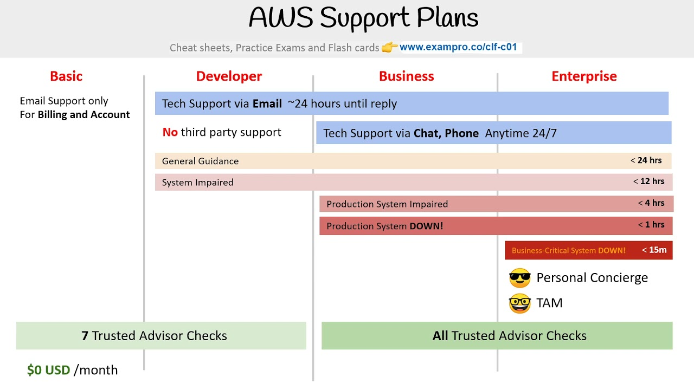

---
layout:
  title:
    visible: true
  description:
    visible: false
  tableOfContents:
    visible: false
  outline:
    visible: false
  pagination:
    visible: false
---

# Cloud Practitioner

## The 6 Pillars of AWS - Well Architected Framework&#x20;

* OSRPCS
* Operational Excellence&#x20;
  * Perform operations as code&#x20;
  * Make frequent, small and reversible changes&#x20;
  * Refine Operations procedures frequently&#x20;
  * Anticipate Failure&#x20;
  * Learn from all operational failures&#x20;
* Security&#x20;
  * Implement a strong identity foundation&#x20;
  * Enable traceability&#x20;
  * Apply Security at all layers
  * Automate Security Best practices&#x20;
  * Protect data in transit and at rest&#x20;
  * Keep people away from data&#x20;
  * Prepare for Security events&#x20;
* Reliability&#x20;
  * Automatically Recover from failure&#x20;
  * Test recovery procedures&#x20;
  * Scale horizontally to increase aggregate workload availability&#x20;
  * Stop guessing capacity&#x20;
  * Manage change in automation&#x20;
* Performance Efficiency&#x20;
  * Democratise Advanced Technologies
  * Go global in minutes
  * Use serverless architectures&#x20;
  * Experiment more often&#x20;
  * Consider mechanical sympathy&#x20;
* Cost Optimisation&#x20;
  * Implement Cloud Financial Management&#x20;
  * Adopt a consumption model&#x20;
  * Measure overall efficiency&#x20;
  * Stop spending money on undifferentiated heavy lifting&#x20;
  * Analyse and attribute expenditure
* Sustainability&#x20;
  * Understand your impact&#x20;
  * Establish Sustainability goals&#x20;
  * Maximize Utilisation&#x20;
  * Anticipate and adopt new, more efficient hardware and software offerings&#x20;
  * Use managed services&#x20;
  * Reduce the downstream impact of your cloud workloads&#x20;

***

## Advantages of Cloud Computing

The six advantages of cloud computing are:&#x20;

* Trade upfront expense for variable expense.
* Benefit from massive economies of scale.&#x20;
* Stop guessing capacity
* Increase speed and agility
* Stop spending money running and maintaining data centers
* Go global in minutes

***

## AWS Support Plans

<figure><figcaption></figcaption></figure>

***

## AWS Service Catalog

AWS Service Catalog allows organizations to create and manage catalogs of IT services that are approved for use on AWS. These IT services can include everything from virtual machine images, servers, software, and databases to complete multi-tier application architectures.

***

Failed Questions Notes in CLF-C02&#x20;

1.  A financial services company wants to migrate from its on-premises data center to AWS Cloud. As a Cloud Practitioner, which AWS service would you recommend so that the company can compare the cost of running their IT infrastructure on-premises vs AWS Cloud?

    * AWS Trusted Advisor
    *   AWS Cost Explorer

        (Incorrect)
    *   AWS Pricing Calculator

        (Correct)
    * AWS Budgets

    \

2.  An IT company wants to run a log backup process every Monday at 2 AM. The usual runtime of the process is 5 minutes. As a Cloud Practitioner, which AWS services would you recommend to build a serverless solution for this use-case? (Select two)

    *   Step Function

        (Incorrect)
    * EC2 Instance
    * Systems Manager
    *   Lambda

        (Correct)
    *   CloudWatch

        (Correct)

    \

3.  A start-up would like to quickly deploy a popular technology on AWS. As a Cloud Practitioner, which AWS tool would you use for this task?

    * AWS Forums
    *   AWS Quick Starts references

        (Correct)
    * AWS Whitepapers
    *   AWS CodeDeploy

        (Incorrect)

    \

4.  Which of the following AWS services can be used to forecast your AWS account usage and costs?

    * AWS Pricing Calculator
    * AWS Budgets
    *   AWS Cost Explorer

        (Correct)
    *   AWS Cost and Usage Reports

        (Incorrect)

    \

5.  A unicorn startup is building an analytics application with support for a speech-based interface. The application will accept speech-based input from users and then convey results via speech. As a Cloud Practitioner, which solution would you recommend for the given use-case?

    * Use Amazon Polly to convert speech to text for downstream analysis. Then use Amazon Translate to convey the text results via speech
    * Use Amazon Translate to convert speech to text for downstream analysis. Then use Amazon Polly to convey the text results via speech
    *   Use Amazon Transcribe to convert speech to text for downstream analysis. Then use Amazon Polly to convey the text results via speech

        (Correct)
    *   Use Amazon Polly to convert speech to text for downstream analysis. Then use Amazon Transcribe to convey the text results via speech

        (Incorrect)

    \

6.  Which of the following AWS services are part of the AWS Foundation services for the Reliability pillar of the Well-Architected Framework in AWS Cloud? (Select two)

    *   AWS Trusted Advisor

        (Correct)
    * AWS CloudFormation
    *   AWS Service Quotas

        (Correct)
    *   Amazon CloudWatch

        (Incorrect)
    * AWS CloudTrail (Incorrect)
    *   Foundations are part of the Reliability pillar of the AWS Well-Architected Framework. AWS states that before architecting any system, foundational requirements that influence reliability should be in place. The services that are part of foundations are: Amazon VPC, AWS Trusted Advisor, AWS Service Quotas (formerly called AWS Service Limits).

        AWS Trusted Advisor is an online tool that provides you real-time guidance to help you provision your resources following AWS best practices on cost optimization, security, fault tolerance, service limits, and performance improvement. Whether establishing new workflows, developing applications, or as part of ongoing improvement, recommendations provided by Trusted Advisor regularly help keep your solutions provisioned optimally.

        Service Quotas enables you to view and manage your quotas for AWS services from a central location. Quotas, also referred to as limits in AWS, are the maximum values for the resources, actions, and items in your AWS account. Each AWS service defines its quotas and establishes default values for those quotas.

    \

7.  Which of the following AWS authentication mechanisms supports a Multi-Factor Authentication (MFA) device that you can plug into a USB port on your computer?

    *   U2F security key

        (Correct)
    * Virtual MFA device
    *   Hardware MFA device

        (Incorrect)
    * SMS text message-based MFA

    \

8.  A developer would like to automate operations on his on-premises environment using Chef and Puppet. Which AWS service can help with this task?

    * AWS Batch
    *   AWS OpsWorks

        (Correct)
    * AWS CloudFormation
    *   AWS CodeDeploy

        (Incorrect)

    \

9.  AWS Compute Optimizer delivers recommendations for which of the following AWS resources? (Select two)

    *   Amazon EC2 instances, Amazon EC2 Auto Scaling groups

        (Correct)
    *   Amazon EBS volumes, AWS Lambda functions

        (Correct)
    * Amazon Elastic File System (Amazon EFS), AWS Lambda functions
    * AWS Lambda functions, Amazon Simple Storage Service (Amazon S3)
    * Amazon EC2 instances, Amazon Elastic File System (Amazon EFS)

    \

10. A company wants to improve the resiliency of its flagship application so it wants to move from its traditional database system to a managed AWS database service to support active-active configuration in both the East and West US AWS regions. The active-active configuration with cross-region support is the prime criteria for any database solution that the company considers.

    \
    Which AWS database service is the right fit for this requirement?

    *   Amazon DynamoDB with global tables

        (Correct)
    * Amazon Relational Database Service (Amazon RDS) for MYSQL
    *   Amazon Aurora with multi-master clusters

        (Incorrect)
    * Amazon DynamoDB with DynamoDB Accelerator

    \

11. Which AWS service can be used to subscribe to an RSS feed to be notified of the status of all AWS service interruptions?

    * AWS Lambda
    * Amazon SNS
    *   AWS Service Health Dashboard

        (Correct)
    *   AWS Personal Health Dashboard

        (Incorrect)

    \

12. AWS Organizations provides which of the following benefits? (Select two)

    *   Provision EC2 Spot instances across the member AWS accounts

        (Incorrect)
    *   Volume discounts for Amazon EC2 and Amazon S3 aggregated across the member AWS accounts

        (Correct)
    * Deploy patches on EC2 instances across the member AWS accounts
    * Check vulnerabilities on EC2 instances across the member AWS accounts
    *   Share the reserved EC2 instances amongst the member AWS accounts

        (Correct)

    \

13. An IT company is on a cost-optimization spree and wants to identify all EC2 instances that are under-utilized. Which AWS services can be used off-the-shelf to address this use-case without needing any manual configurations? (Select two)

    * AWS Budgets
    *   AWS Cost Explorer

        (Correct)
    *   AWS Trusted Advisor

        (Correct)
    * AWS Cost and Usage Reports
    *   Amazon CloudWatch

        (Incorrect)

    \

14. What is the primary benefit of deploying an RDS database in a Read Replica configuration?

    * Read Replica reduces database usage costs
    *   Read Replica improves database scalability

        (Correct)
    * Read Replica protects the database from a regional failure
    *   Read Replica enhances database availability

        (Incorrect)

    \

15. A gaming company is looking at a technology/service that can deliver a consistent low-latency gameplay to ensure a great user experience for end-users in various locations.

    \
    Which AWS technology/service will provide the necessary low-latency access to the end-users?

    *   AWS Edge Locations

        (Incorrect)
    *   AWS Local Zones

        (Correct)
    * AWS Wavelength
    * AWS Direct Connect

    \

16. A Cloud Practitioner would like to get operational insights of its resources to quickly identify any issues that might impact applications using those resources. Which AWS service can help with this task?

    *   AWS Systems Manager

        (Correct)
    * Amazon Inspector
    *   AWS Personal Health Dashboard

        (Incorrect)
    * AWS Trusted Advisor

    \

17. Which benefit of Cloud Computing allows AWS to offer lower pay-as-you-go prices as usage from hundreds of thousands of customers is aggregated in the cloud?

    * Go global in minutes
    *   Massive economies of scale

        (Correct)
    *   Trade capital expense for variable expense

        (Incorrect)
    * Increased speed and agility

    \

18. Which of the following AWS Support plans provides access to online training with self-paced labs?

    *   Enterprise

        (Correct)
    * Business
    * Basic
    *   Developer

        (Incorrect)

    \

19. Which of the following AWS services are always free to use (Select two)?

    *   Simple Storage Service (Amazon S3)

        (Incorrect)
    * DynamoDB
    * Elastic Compute Cloud (Amazon EC2)
    *   AWS Auto Scaling

        (Correct)
    *   Identity and Access Management (IAM)

        (Correct)

    \
